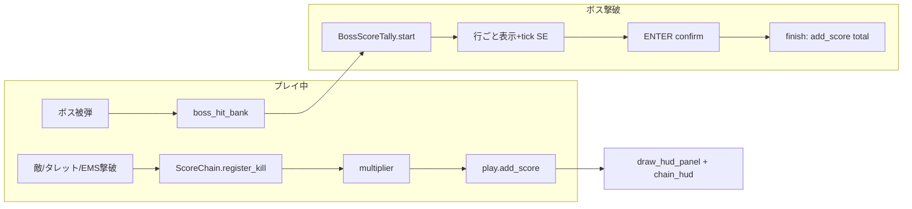

# スコアシステム分析 — BUSAKAWA ALIEN BATTLE2

実装の一次ソース: [`score_system.py`](../score_system.py)、[`settings.py`](../settings.py)（`DifficultyConfig`）、[`game_loop/`](../game_loop/) 各フェーズ。

---

## 1. 現状アーキテクチャ（再確認）

### 1.1 二層構造

| 層 | クラス | 役割 |
|----|--------|------|
| リアルタイム | `ScoreChain` | 連続撃破チェーン・倍率・ボス戦中の「戦闘点バンク」 |
| 区切り演出 | `BossScoreTally` | ボス撃破後の内訳表示 → 一括加算 |

通常プレイの `play.score` は **敵/タレット/EMS/アイテム** で即時加算。ボス本体へのダメージは **即スコアに入らず** `boss_hit_bank` に蓄積し、撃破時の `BossScoreTally` で「ボス戦闘点」としてまとめて加算される。

```text
敵撃破 ──► score_enemy_kill() ──► play.add_score()     （即時）
タレット ──► score_turret_kill() ──► play.add_score()
EMS全滅 ──► score_ems_kill() ──► play.add_score()
ボス被弾 ──► add_boss_hit() ──► boss_hit_bank のみ     （遅延）
ボス撃破 ──► start_boss_score_tally() ──► 行ごと演出 ──► finish で add_score(total)
```

### 1.2 チェーン（`ScoreChain`）

| 項目 | 値 | 意味 |
|------|-----|------|
| `CHAIN_MAX_FRAMES` | 150 | 約 2.5 秒（60fps）以内に次撃破が必要 |
| `MULTIPLIER_TABLE` | 1,1,2,2,3,4,5,6,7,8,9,10,12,14,16,16 | `chain` をインデックスに倍率（最大 ×16） |
| チェーン切れ | `combat.apply_player_hit()` → `break_chain()` | 被弾で chain/timer リセット |
| 5連続以降ボーナス | `chain_kill_bonus` | `combo_base × (chain-4) × mult × score_scale` |

撃破ごと: `enemy_base_score × mult × score_scale` + 上記ボーナス（NORMAL 例: 500×mult + combo）。

### 1.3 ボス戦闘点バンク

- ボス出現時 `begin_boss_fight(diff, boss_type)` でキャップ設定（`BOSS_HIT_CAP` × `score_scale`）。
- 1発ごと: `boss_hit_score × damage × mult × score_scale` を加算試行、**キャップ超過分は捨て**。
- キャップ例（`score_scale=1`）: B1 80k … B5 220k。

### 1.4 ボス撃破確定（`BossScoreTally`）

中間ボス（B1–B4）の行の例:

- ボス戦闘点（バンク合計）
- ボス撃破（`boss_kill_base × boss_type × mult × score_scale`）
- ノーダメージ（`boss_nodmg_base × boss_type × …`）
- 速攻（戦闘フレームが `60×25×boss_type` 未満）
- 残機ボーナス

ラストボス（B5）: 上記の 5 倍スケール + クリアボーナス + 速攻は 180 秒基準。

演出:

- パネル「SCORE LOCK」/ 行ラベル + `+金額` を 38f/行でカウントアップ
- `score_tick.wav` が行進行時
- 合計表示後 `PRESS ENTER` 点滅 → `confirm_enter()` で即完了・`finish_boss_score_tally` コールバック
- 中は `_gameplay_paused` でスポーン等停止

**未接続**: `BossScoreTally.skip()` は定義のみ（スキップ入力なし）。

### 1.5 難易度パラメータ（NORMAL 基準）

| キー | NORMAL | 役割 |
|------|--------|------|
| `score_scale` | 1.0 | 全局スコア倍率（HARD 1.5 / NM 2.0） |
| `enemy_base_score` | 500 | 雑魚1体 |
| `turret_score` | 3000 | タレット |
| `combo_base` | 1500 | 5連続以降の加算単位 |
| `boss_hit_score` | 10 | ×弾 damage |
| `boss_kill_base` | 30000 | 撃破ボーナス係数 |
| `clear_bonus` | 150000 | B5 クリア行 |

### 1.6 表示まわり（演出）

| UI | 場所 | 内容 |
|----|------|------|
| `draw_hud_panel` | 左上 | SCORE 数値、倍率>1 なら `xN` |
| `draw_chain_hud` | 右上 | CHAIN 数、×倍率、減衰バー |
| `BossScoreTally.draw` | 画面中央 | 内訳パネル |
| `BubbleMessage` | ボス撃破後 | `boss_kill_N` 台詞 |
| ENDING / GAMEOVER | 全画面 | スコア・ハイスコア・更新表示 |

**ないもの**: 撃破時のフローティング数字、グレイズ、HIT 巨大カウンタ、弾消しボーナス、ステージクリアの別演出。

### 1.7 その他の加算経路

- パワーアップ取得: `world_updates` で固定 **500 × chain倍率**（種別による差なし）。
- `kill_count` / `boss_kills`: ボス出現条件のみ。スコア式には未使用。

---

## 2. 他ゲームとの比較（方式）

### 2.1 比較表

| 作品系統 | コアの「伸ばし方」 | チェーン維持 | ボススコアの性格 | 本ゲームとの距離 |
|----------|-------------------|--------------|------------------|------------------|
| **DoDonPachi (GPS)** | 敵連鎖 + GPゲージ + レーザー張り付け | ゲージ空で減衰（完全即死ではない版も） | 弾消し・ハイパー・大量 HIT | チェーン概念は近いが **GPゲージ・弾消し・HIT表記なし** |
| **斑鸠 Ikaruga** | 極性3体チェーン（倍率2倍刻み） | 誤撃破でリセット | **残り時間×1万/秒** | 色条件なし・時間ボーナスなし |
| **Radiant Silvergun** | **色3体セット** + パーツ破壊 | 色混ぜでリセット | 全パーツ破壊「PERFECT」、グレイズ | **色ルールなし**、パーツ個別スコアはバンクに近い |
| **虫姫さま** | 連鎺 + **ノーミス条件** + 青虫 | 被弾でノーミス終了 | 道中ボス・終焉ボス別設計 | ノーミス縛り・リトライ設計なし |
| **東方** | 撃破点 + ボム効率 + スペルボーナス | 被弾でパワー/down 中心 | ステージクリアボーナス明示 | **弾幕＝被弾ペナは似る**、スペルボーナスなし |
| **R-Type Final 等** | ミッション評価・内訳表 | ミッション単位 | **クリア後 S/A 内訳** | **SCORE LOCK パネルが最も近い** |

### 2.2 本ゲームの位置づけ（一言）

**「STG 的チェーン倍率 + ボス戦はダメージをバンクして撃破時にレトロ内訳表」** のハイブリッド。CAVE 系の「HIT を画面いっぱいに伸ばす」より、**ホーム縦スクロール＋RPG 的ボス報酬テーブル** に寄っている。

---

## 3. 他ゲームの「スコア演出」分析

### 3.1 プレイ中フィードバック

| 演出タイプ | 代表例 | 心理効果 | 本ゲーム |
|------------|--------|----------|----------|
| **巨大 HIT / COMBO 数字** | DDP, 虫姫 | 連鎖の手応え・SNS映え | CHAIN 小パネルのみ |
| **GP / ゲージ** | DDP, DF | 「今切ると損」の常時圧 | 150f バー（右上）のみ |
| **フローティング +XXXX** | 多くの ARPG / モバイル STG | 毎撃破の即報酬 | **なし** |
| **グレイズ数・ボーナス** | RS, 斑鸠, 東方一部 | リスクプレイの別軸 | **なし** |
| **倍率色変化** | チェーン上限接近時 | 緊張のピーク | mult 色分け（>1 で黄） |
| **ランク / グレード** | RS 武器Lv, 評価 S | スコア＝成長と直結 | スコアと武器Lvは独立 |

### 3.2 区切り（ボス・ステージ）演出

| 演出タイプ | 代表例 | 本ゲーム |
|------------|--------|----------|
| **撃破ボーナス数字のカウントアップ** | アーケード全般 | `BossScoreTally` 行単位（38f） |
| **パーツ破壊ごとのポップ** | RS, グラディウス系 | バンクに合算のみ（個別表示なし） |
| **タイムボーナス残秒表示** | Ikaruga | 速攻は内訳1行のみ |
| **ノーダメージ章** | 多くの STG クリアボーナス | 行ラベル「ノーダメージ」 |
| **スキップ / 早送り** | 現代移植版 | `skip()` 未配線 |
| **リザルトランキング** | オンライン STG | ローカル `hiscore.dat` のみ |

### 3.3 本ゲーム演出の強み・弱み

**強み**

- ボス後の **SCORE LOCK** は「何で点が伸びたか」が読みやすく、カジュアル層向き。
- チェーンと HUD 倍率が二重表示され、慣れれば「あと何秒で切れるか」が分かる。
- 被弾でチェーン切れ → リスクと報酬が直結。

**弱み（他名作との差）**

- 道中の **手応えが弱い**（数字が飛ばない・HIT が小さい）。
- ボス戦で **スコアが伸びている感**が HUD に出ない（バンク不可視）。
- 上級者向けの **第3軸**（グレイズ・色・弾消し）がない。
- 確定演出が **ENTER 待ち固定**でテンポが止まる（スキップ未実装）。

---

## 4. データフロー図（現状）



---

## 5. 拡張の方向性（参考・未実装）

エクストラステージ構想（[`extra_stage_design.md`](extra_stage_design.md)）と整合させる場合の例:

| 優先度 | 案 | 参照ゲームの要素 |
|--------|-----|------------------|
| 高 | ボス戦中 `boss_hit_bank` の薄い HUD 表示 | RS の破壊率、DDP のボス側ゲージ |
| 高 | 確定中 `skip()` をボタン/長押しに割当 | 現代 STG リザルト |
| 中 | 撃破ポップアップ（+500 等）オプション | モバイル STG |
| 中 | チェーン 10/15 到達時 SE + 1 秒フラッシュ | 虫姫・DDP の区切り |
| 低 | グレイズ / 接近ボーナス | RS, 斑鸠 |
| 低 | 色3体チェーン（敵タイプ再設計が必要） | RS |

---

## 6. 関連ファイル早見

| ファイル | 内容 |
|----------|------|
| `score_system.py` | 式・テーブル・HUD・Tally 描画 |
| `game_loop/gameplay_score_boss.py` | chain tick / tally update |
| `game_loop/boss_tally.py` | tally 開始・finish |
| `game_loop/bullet_collisions.py` | 撃破加算・`add_boss_hit` |
| `game_loop/phases/hud_results.py` | HUD / tally 描画タイミング |
| `combat.py` | `break_chain` |
| `boss_spawn.py` | `begin_boss_fight` |
| `docs/namespace_keys.md` | `score_tick_sound` 等 |

---

*最終確認: コードベース 2026-05（`BossScoreTally.skip` 未使用、`add_boss_hit` の戻り値は加算に未使用）。*
